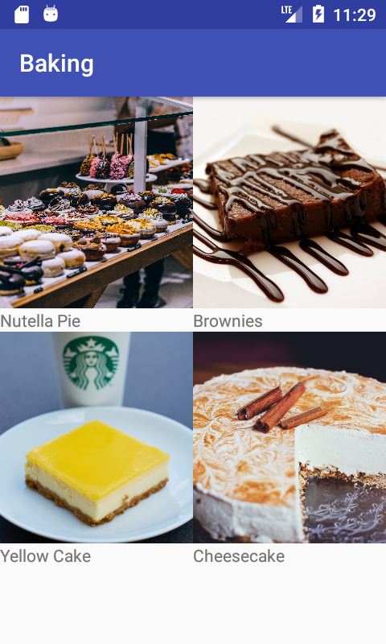
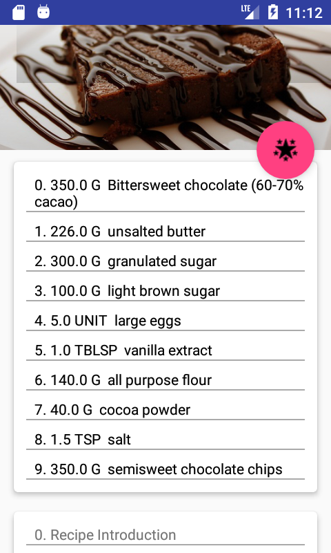
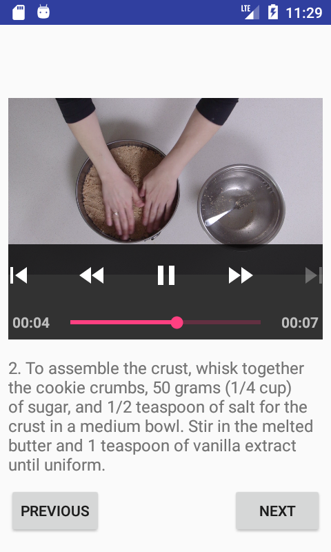
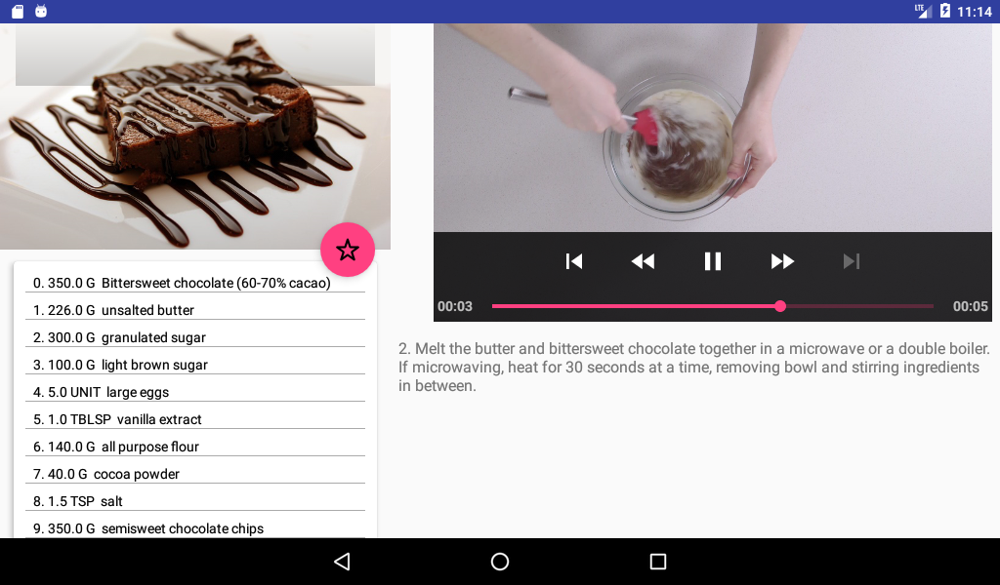

# Baking App
Baking is the third project of Android Nanodegree from Udacity. The purpose of the project is to build an android application to display cake recipes and show video instructions to bake the cake. In addition, the app is optimized for tablet with dual pane layout. 

   

## Installation
Build the application by using android studio. The minimum sdk version is 21 and the target sdk version is 26.

## Implementation
To implement the application, several supporting libraries are leveraged. Moreover, Model-View-Presenter architecture is applied to ensure the cleanness and maintainability of the code.

#### Supporting libraries
- [dagger](https://google.github.io/dagger/) for dependency injection
- [RxJava](https://github.com/ReactiveX/RxJava) for reactive programming
- [picasso](http://square.github.io/picasso/) for loading images from internet
- [okhttp](http://square.github.io/okhttp/) for network call
- [ExoPlayer](https://github.com/google/ExoPlayer
) for showing videos.

#### MVP architecture
MVP([Model-View-Presenter](https://stackoverflow.com/questions/2056/what-are-mvp-and-mvc-and-what-is-the-difference)) is an architecture with three components:
- Presenter contains the business logic for UI and communicates with View with an interface.
- View is responsible to receive commands from Presenter and show them to the UI.
- Model is used to manage data.

## License:
Popular movie application was created by Juan Karsten in 2017. It is a free software and may be distributed under [MIT License](https://opensource.org/licenses/MIT).
